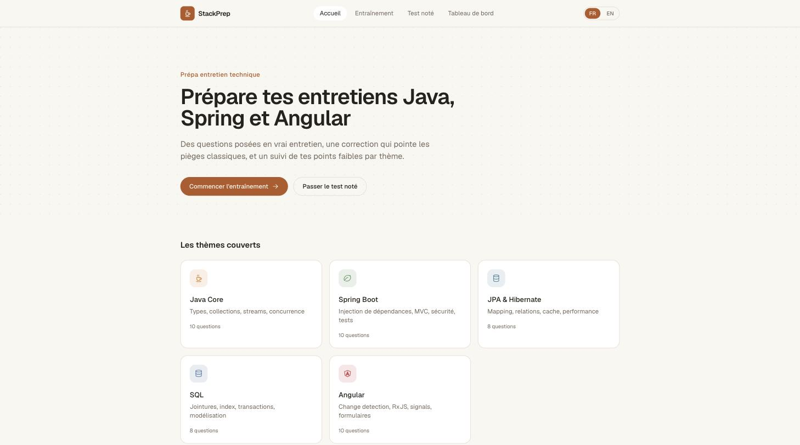
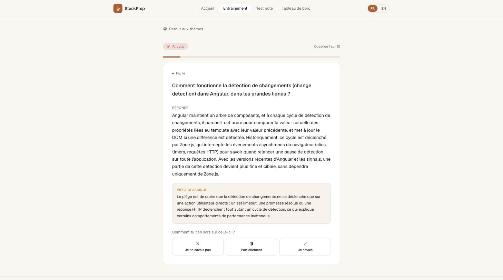
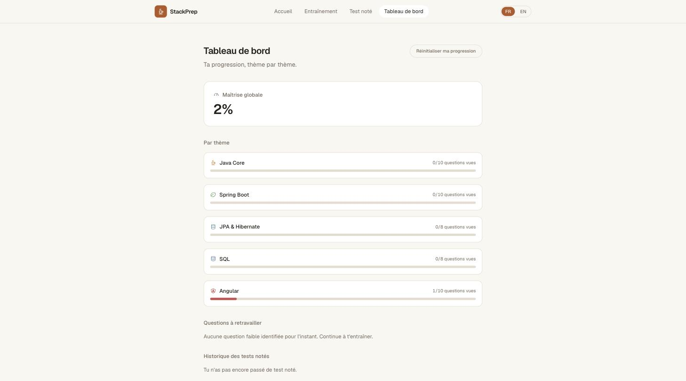

# StackPrep

Interview training for Java, Spring Boot and Angular technical interviews: questions phrased the way a real interviewer would ask them, corrections that call out the classic traps, progress tracking by topic, and a graded test that simulates a pre-interview review.

**Live demo: [stackprep-fawn.vercel.app](https://stackprep-fawn.vercel.app)**

[README en français](./README.md)

## Table of contents

- [Features](#features)
- [Preview](#preview)
- [Tech stack](#tech-stack)
- [Quick start](#quick-start)
- [Project structure](#project-structure)
- [Environment variables](#environment-variables)
- [Quality and tests](#quality-and-tests)
- [Deployment](#deployment)
- [Roadmap](#roadmap)
- [License](#license)

## Features

- **Question bank** organized by topic: Java Core, Spring Boot, JPA & Hibernate, SQL, Angular, each question tagged with a difficulty level
- **Practice mode** per topic: the question is asked with no hint, then a detailed answer, the associated common trap, and finally a self-rating (I knew it / partially / I didn't know)
- **Progress dashboard**: overall mastery, breakdown by topic with progress bars, list of questions to revisit, graded test history
- **Graded test**: a draw of questions across every topic, weighted toward identified weak spots, with a final score and a readiness tier (ready / almost ready / still work to do)
- **Bilingual interface**, French/English, with translated content, not just the UI
- **Fully local**: no account, no data sent to a server, progress stays in the browser

Unlike devupnow.fr, which inspired the concept, StackPrep has no user account, no ranking between developers and no mobile app: it's a personal training tool that runs entirely client-side.

## Preview

| Home | Practice | Dashboard |
|---|---|---|
|  |  |  |

## Tech stack

- [Next.js](https://nextjs.org) (App Router, Turbopack)
- [TypeScript](https://www.typescriptlang.org)
- [Tailwind CSS](https://tailwindcss.com)
- [next-intl](https://next-intl.dev) for bilingual routing and content
- Local storage (`localStorage`) for progress, no database or API

## Quick start

Requirements: Node.js 20+.

```bash
git clone https://github.com/riadh-mnasri/stackprep.git
cd stackprep
npm install
npm run dev
```

The app runs on [http://localhost:3690](http://localhost:3690).

## Project structure

```
src/
  app/[locale]/        Routes (home, practice, graded test, dashboard)
  components/          UI components (question engine, dashboard, etc.)
  content/              Question bank and topic metadata
  i18n/                 next-intl configuration (routing, navigation)
  lib/                  Progress store (localStorage) and stats calculations
  proxy.ts             Next.js proxy for locale routing
messages/               FR/EN translation files for the interface
```

## Environment variables

None needed: the app has no backend.

## Quality and tests

```bash
npm run lint
```

No dedicated test suite yet: this is a content app, not an architecture showcase project.

## Deployment

Deployed on Vercel with the GitHub integration connected: pushing to `main` triggers an automatic production deployment.

```bash
vercel --prod
```

## Roadmap

- [x] Practice engine (questions, correction, self-rating)
- [x] Progress dashboard
- [x] Graded test weighted toward weak spots
- [x] Deployed to production
- [ ] Grow the question bank over time
- [ ] Add more topics if needed (Docker, Kubernetes, system design...)

## License

© 2026 Riadh MNASRI
